# Architecture of STC-app

This document captures the architecture of the Smart Trash Can Application (STC-app), using the arc42 template.

# Introduction and Goals

This app helps people to put their trash into the right bin, by analyzing the trash with their smartphone camera.

## Requirements Overview

> 💡 **Requirements IDs** can be generated by some tools, and indeed we do that with the other case studies. In this project, we create them by hand, because we are pragmatic, not religious.

Essential Features

* **R-01**: Classify trash correctly with smartphone camera
* **R-02**:Identify the correct bin for the identified trash, based on regional laws

Optional Features

* **R-03**: Generate printable labels with QR-Codes that the user can fix to a trash area, to allow app to identify it.
* **R-04**: Order replacement trash bags via the app.

## Quality Goals

  Quality Goal | Reason
--- | ---
**R-06**: Code and documentation follows best practices, no shortcuts. | Main purpose of this project is the book, not the trash
**R-07**: App works directly after installation. | Low-friction user experience
**R-08**: Number of uses is limited, until the user either pays or provides an AI API code. | We need some kind of cost control, and do not want to use ads to finance the app.

## Stakeholders

Role/Name   | Contact        | Expectations
---|---|---
Person with trash | | Low-friction help for recycling trash correctly.
Reader | | Concepts in the book become more understandable by a working example.
| Book author | Michael | Creating this product leads to better and more consistent content of the *Product Velocity* book.

# Architecture Constraints

* Works on all smartphones.
* Requires user to provide their own GPT API code.

# Context and Scope

## Business Context

**\<Diagram or Table>**

**\<optionally: Explanation of external domain interfaces>**

## Technical Context

**\<Diagram or Table>**

**\<optionally: Explanation of technical interfaces>**

**\<Mapping Input/Output to Channels>**

# Solution Strategy

> 💡 **C4 Model** We want to use a C4 model for our architecture. However, gitHub rendering (mermaid) has only limited C4 support. We have to make a trade-off between (1) pretty rendering, but not having a single source, (2) ugly rendering and single source, or (3) pretty rendering, but not being 100% C4-compliant. This is option (3).

### System Context

```mermaid
graph TD
    %% Nodes
    user(["👤 User<br/><small>A person with trash</small>"])
    oauth(["OAuth<br/><small>If used with account</small>"])
    stc["STC-app<br/><small>Smart Trash Can App</small>"]
    bins(["Bins<br/><small>Recycling bins (region-specific)</small>"])
    server(["AI API Server<br/><small>External classification service</small>"])

    %% Edges
    user -->|uses to classify and dispose of trash| stc
    stc -->|requests classification using image| server
    user -->|physically disposes trash| bins
    stc -->|suggests correct bin| bins
    stc -->|user authentication| oauth

```

### Container View

```mermaid
graph TD
    %% External Actors
    user["👤 User<br/><small>Interacts with the client app</small>"]
    serverAI["AI API Server<br/><small>External service for trash classification</small>"]
    oauth["OAuth Provider<br/><small>User authentication (optional)</small>"]

    %% Internal Containers
    client["Client App<br/><small>Mobile or web app used by the user</small>"]
    backend["Backend Server<br/><small>Handles logic, bin suggestion, authentication, API access</small>"]

    %% Grouping: STC-app
    subgraph STC-app
        client
        backend
    end

    %% Relationships
    user --> client
    client -->|REST API| backend
    backend --> serverAI
    backend --> oauth
```

# Building Block View

## Whitebox Overall System

***\<Overview Diagram>***

Motivation  
*\<text explanation>*

Contained Building Blocks  
*\<Description of contained building block (black boxes)>*

Important Interfaces  
*\<Description of important interfaces>*

### \<Name black box 1>

*\<Purpose/Responsibility>*

*\<Interface(s)>*

*\<(Optional) Quality/Performance Characteristics>*

*\<(Optional) Directory/File Location>*

*\<(Optional) Fulfilled Requirements>*

*\<(optional) Open Issues/Problems/Risks>*

### \<Name black box 2>

*\<black box template>*

### \<Name black box n>

*\<black box template>*

### \<Name interface 1>

…

### \<Name interface m>

## Level 2

### White Box *\<building block 1>*

*\<white box template>*

### White Box *\<building block 2>*

*\<white box template>*

…

### White Box *\<building block m>*

*\<white box template>*

## Level 3

### White Box \<\_building block x.1\_\>

*\<white box template>*

### White Box \<\_building block x.2\_\>

*\<white box template>*

### White Box \<\_building block y.1\_\>

*\<white box template>*

# Runtime View

## \<Runtime Scenario 1>

-   *\<insert runtime diagram or textual description of the scenario>*

-   *\<insert description of the notable aspects of the interactions
    between the building block instances depicted in this diagram.>*

## \<Runtime Scenario 2>

## …

## \<Runtime Scenario n>

# Deployment View

## Infrastructure Level 1

***\<Overview Diagram>***

Motivation  
*\<explanation in text form>*

Quality and/or Performance Features  
*\<explanation in text form>*

Mapping of Building Blocks to Infrastructure  
*\<description of the mapping>*

## Infrastructure Level 2

### *\<Infrastructure Element 1>*

*\<diagram + explanation>*

### *\<Infrastructure Element 2>*

*\<diagram + explanation>*

…

### *\<Infrastructure Element n>*

*\<diagram + explanation>*

# Cross-cutting Concepts

## *\<Concept 1>*

*\<explanation>*

## *\<Concept 2>*

*\<explanation>*

…

## *\<Concept n>*

*\<explanation>*

# Architecture Decisions

# Quality Requirements

## Quality Tree

## Quality Scenarios

# Risks and Technical Debts

# Glossary

| Term        | Definition        |
|-------------|-------------------|
| *\<Term-1>* | *\<definition-1>* |
| *\<Term-2>* | *\<definition-2>* |
