# Architecture of Smart Trash Can (STC) "App Edition"

This document captures the architecture of the Smart Trash Can Application (STC-app), using the arc42 template.

# Introduction and Goals

This app helps people to put their trash into the right bin, by analyzing the trash with their smartphone camera.

## Feature Overview

This section outlines the high-level functional capabilities of the app

### Essential Features

* Classify trash correctly with smartphone camera
* Identify the correct bin for the identified trash, based on regional laws

### Optional Features

* Generate printable labels with QR-Codes that the user can fix to a trash area, to allow app to identify it.
* Order replacement trash bags via the app.

## Quality Goals

These goals define non-functional priorities such as maintainability, usability, and operational constraints. They influence architectural and implementation decisions throughout the project.

  Quality Goal | Reason
--- | ---
Code and documentation follows best practices, no shortcuts. | Main purpose of this project is the book, not the trash
App works directly after installation. | Low-friction user experience
Number of uses is limited, until the user either pays or provides an AI API code. | We need some kind of cost control, and do not want to use ads to finance the app.

## Stakeholders
These are the relevant stakeholders, along with their expectations and how the system should meet their needs.

Role/Name   | Expectations
---|---
Person with trash | Low-friction help for recycling trash correctly.
Book Reader | Concepts in the book become more understandable by a working example.
| Book author | Creating this product leads to better and more consistent content of the *Product Velocity* book.

# Constraints
This section defines the fixed technical, organizational, or regulatory boundaries that the architecture must respect.

Constraint   | Explanation
---|---
Must work on modern smartphones | We do not want to limit the use to just one ecosystem.
No app store distribution | As a textbook case study we do not want to deal with the overhead of dealing with an app store distribution process
Open source | As a textbook case study, there is no commercial motivation and the project must be as accessible as possible.

# Context and Scope

The C4 System Context diagram visualizes everything our system (the STC) is interacting with. It defines the system's scope by showing who uses it, what external services it depends on, and how it fits into the broader environment. This helps establish clear boundaries and shared understanding early in the design process. Note that you can form sentences by following the arrows:

```
User → physically disposes trash into → bins
```


# Solution Strategy

We make the following decisions for this project.

**Decision** | **Rationale / Description**
--- | ---
Use a single git repository for all code and scripts | For a small, simple app, with a tightly coupled frontend and backend, as well as a small team, the complexity of multiple repositories is not justified.
Use GitHub for code, issues, CI workflows, and community collaboration | It will be an open source project, gitHub is widely used and simple.
Docker Deployment with Docker Compose | Docker standardizes environments across dev/test/deploy.  This app is unlikely to require scalability, but if it does, switching to Kubernetes would be fairly easy.
Use Typescript as primary programming language | Widely supported, strong typing, scalable, state of the art.
Use Single Page App (SPA) with Typescript Vue/Vuetify  | Enables cross-platform deployment via browser. Allows installable experience without going through app stores. Simplifies client updates.
Use Node.js backend with MongoDB | Simplifies development using TypeScript stack end-to-end. MongoDB supports flexible schema for user and session data.
Use OAuth (Auth0) for user authentication | Provides secure, standardized user login. Offloads auth logic from app backend.
Use GPT API for trash classification | Leverages high-quality image classification via external AI service. Avoids local model maintenance.
Use AI and location to find recycling rules | Provdes GPS coordinates to the AI to make sure the correct recycling rules are used. While this might not be 100% accurate all the time, It's a pragmatic choice for this project.

# Building Block View

> 💡 **C4 Model** We want to use a C4 model for our architecture. However, gitHub rendering (mermaid) has only limited C4 support. We have to make a trade-off between (1) pretty rendering, but not having a single source, (2) ugly rendering and single source, or (3) pretty rendering, but not being 100% C4-compliant. This is option (3).

A C4 model is primarily a communication tool. W adopt it as follows:

* We include elements from the physical world to make clear how they related to the software.
* For a system as simple as this one, we only use the first two levels.

### Container View

The C4 Container diagram zooms into the STC system to show its internal structure. It illustrates the major building blocks—called containers—such as the web app, backend server, and database, and explains how they interact. This level of detail clarifies how responsibilities are split across components and how data flows through the system. 

We add additional technical information. In addition to the verbal description, for Containers we add types and technologies (e.g. MongoDB), and for relationships we add protocols (e.g. JSON/HTTPS).

```mermaid
flowchart TD
    %% External Actors
    user(["👤 User<br/><small>【Person】<br/>Interacts with the client app</small>"])
    smartphone(["Smartphone<br/><small>【Host Device】<br/>Device the app running on in web browser or as web app</small>"])
    oauth(["OAuth Provider<br/><small>【Cloud Service】<br/>Auth0 used for user authentication</small>"])
    serverAI(["AI Server<br/><small>【Cloud Service】<br/>GPT API used for trash classification</small>"])

    %% Internal Containers
    client["Single-Page Web App<br/><small>【Typescript and vue/vuetify】<br/>Web app used by the user</small>"]
    db["🛢️ Database<br/><small>【MongoDB】<br/>Stores user information.</small>"]

    backend["Backend Server<br/><small>【Typescript and node】<br/>Handles logic, bin suggestion, authentication, API access</small>"]
    
    %% Grouping: STC
    subgraph STC
        client
        backend
        db
    end

    %% Relationships
    user --> | uses web app<br/><small>【HTTPS】</small>| client
    client --> | makes API calls to<br/><small>【JSON/HTTPS】</small>| backend
    smartphone --> | captures trash with camera and location<br/><small>【WebRTC API】</small> |client
    backend --> | reads from and writes to<br/><small>【MongoDB protocol】</small> | db
    backend ---> | makes API calls to<br/><small>【JSON/HTTPS】</small> | serverAI
    backend ---> | makes API calls to<br/><small>【JSON/HTTPS】</small> | oauth
```




# Runtime View

This section visualizes dynamic aspects, typically with sequence diagrams. For an application as simple as this one, a diagram is almost overkill. Therefore, we only show the first one with a diagram.

## Normal usage

This Scenario assumes that the user has not exceeded their quota yet. (If she has exceeded her quota, she needs to provide a GPT API key or log in and pay.)


## Other Scenarios

Other scenarios include:

* Initial use (no user exists in the database yet)
* Quota exceeded: Provide GPT API key
* Quota exceeded: Create an account
* Timeout of AI service
* Location permission missing (user can manually provide location)

# Deployment View

The Smart Trash Can (STC) app is deployed as a web-based system composed of a frontend Single Page Application (SPA), a backend service, and external service integrations. It is designed for low-friction deployment using Docker Compose, suitable for small-scale usage and self-hosting by users or readers of the book.

We make the decision to run app and backend from the same container. This simplifies the deployment significantly, as the two will always be synchronized and we won't have to deal with CORS.

## Mapping of Building Blocks to Infrastructure

Component | Infrastructure Element
--- | ---
SPA frontend | Static files served by backend container (Node.js/Express)
Backend | Node.js container in same Docker Compose setup
Database | MongoDB container in same Docker Compose setup
GPT API | External service (user-provided key or own key with payment)
OAuth (Auth0) | External cloud service


# Cross-cutting Concepts

Topic | Concern
--- | ---
Error Handling and Logging | Unified handling of errors across frontend and backend is important, as well as logging for troubleshooting.
Internationalization | When retrieving recycling information, in which language to we retrieve it?
Content Delivery | SPA is built statically but served dynamically alongside API.Concerns include routing, caching, etc.
Privacy and Data Handling | User-generated image data, classification results, and possibly location are sensitive.
Deployment and Configuration Management | Configuration of GPT and Auth0 keys, as well as DNS and SSL (LetsEncrypt)
Cost Control / Usage Limiting | Enforcement of quota can be tricky/bypassed without user account.

# Architecture Decisions

Here, we log decisions as they come up during development. This information complements the Solution Strategy above (don't be redundant!)
